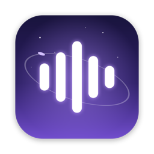
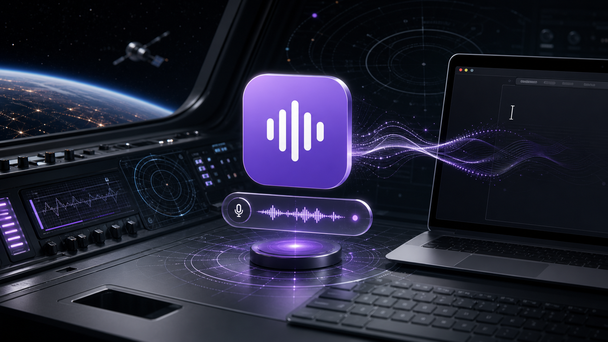
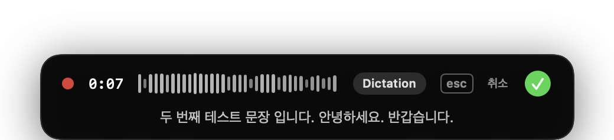
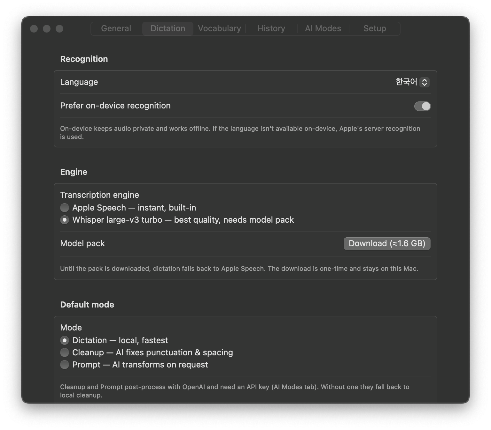
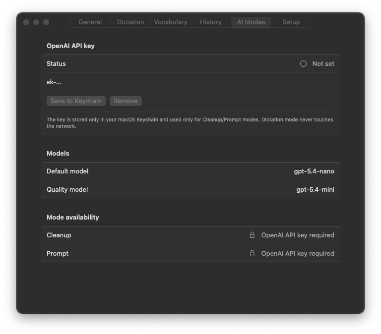

<div align="center">



# Sokki

**속기(速記) — a stenographer in your menu bar.**

Press a key. Speak. Your words land at the cursor.
Local-first macOS dictation for Korean, English, and code-mixed speech.




</div>

---

<div align="center">



*The real thing: live waveform, elapsed time, and the transcript streaming in — the pill never steals focus from the app you're dictating into.*

</div>

---

## Why Sokki

Dictation tools either ship your voice to a server, ignore Korean, or garble
sentences that mix 한국어 and English — which is how developers actually talk.
Sokki is built for exactly that speech, and everything runs on your Mac.

- ⚡ **Instant** — global shortcut (`⌃⌥Space`) or a bare **🌐 fn tap** from any app. Tap to toggle, or hold to talk and release to insert.
- 🇰🇷 **Korean + English + code-mixed** — with the Whisper engine, "에이피아이 엔드포인트 확인해줘" comes out as *"api 엔드포인트를 확인해 주세요"* — English terms stay in Latin script.
- 🔒 **Local-first** — streaming recognition is on-device, Whisper runs on-device, history is local SQLite. Audio never leaves your Mac.
- 🩹 **Self-healing** — if the live session drops your words, the captured audio is automatically re-transcribed before you ever see "no speech detected".

## Features

|  |  |
| --- | --- |
| 🎙️ **Streaming dictation** | Apple Speech partials render live in the recording pill — no model download needed to start |
| 🧠 **Whisper large-v3 turbo** | Optional model pack (≈1.6 GB, one-time in-app download) re-transcribes the final text for superwhisper-class quality |
| 🌐 **fn key trigger** | Opt-in: tap fn to toggle, hold fn for push-to-talk — fn combos (fn+arrows, fn+F-keys) are left alone |
| 📋 **Smart insertion** | Auto-paste at the cursor (Accessibility), clipboard fallback without it, or character-typing for paste-hostile apps |
| 📔 **Vocabulary & replacements** | Deterministic fixes ("속기" → "Sokki") that are also fed to the recognizer as hints |
| 🕘 **Local history** | Searchable SQLite history with optional audio, 30-day auto-cleanup, one-click delete all |
| ✨ **AI modes (optional)** | Cleanup/Prompt post-processing via OpenAI — transcript-only payloads, key in the macOS Keychain, local fallback on failure |

## Install

**The lazy way** — tell your AI agent (Claude Code, Codex, …):

> Install Sokki by following https://github.com/yansfil/sokki/blob/main/INSTALL.md

[`INSTALL.md`](INSTALL.md) is written as an agent install contract: the agent
does everything end to end and only stops where macOS requires *you* to click
(permission prompts).

**By hand** — grab the DMG from the [latest release](https://github.com/yansfil/sokki/releases/latest),
drag `Sokki.app` into Applications, and launch. Or build from source:

```sh
git clone https://github.com/yansfil/sokki.git
cd sokki
./scripts/package-app.sh
ditto dist/Sokki.app /Applications/Sokki.app
open /Applications/Sokki.app
```

A welcome window walks you through the three permissions, your dictation
language, and a built-in test field. Then press `⌃⌥Space` in any app and
start talking. Installed in `/Applications`, the app launches from Spotlight
like any other app.

> **Unsigned build note** — releases aren't notarized yet. If macOS blocks
> the app, right-click → Open once, or `xattr -dr com.apple.quarantine /Applications/Sokki.app`.

Full setup, screenshots, and troubleshooting: **[docs/onboarding.md](docs/onboarding.md)**

## The Whisper Engine

Settings → Dictation → **Engine**:



- The pill keeps streaming **live** partials through Apple Speech — zero added latency while you speak.
- When you stop, the captured audio is re-transcribed by **Whisper large-v3 turbo** (WhisperKit CoreML, fully on-device) and that's what gets inserted.
- No pack downloaded? Whisper fails? You silently get the streaming transcript instead — dictation never breaks.
- With language set to *Automatic*, Whisper detects the spoken language on its own.

## The fn Key

Settings → General → **"Also trigger with the 🌐 fn key"**:



macOS reserves the bare fn key, so this is opt-in: it uses the same
Accessibility permission as auto-paste, and you set System Settings →
Keyboard → *"Press 🌐 key to"* → **Do Nothing** so the emoji picker stays
out of your way.

## Privacy

- Streaming recognition prefers on-device Apple Speech; Whisper is always on-device.
- The optional OpenAI modes send **transcript text and your explicit vocabulary hints only** — never audio, clipboard, selected text, cursor surroundings, or app names.
- History (and optional audio) is local SQLite under Application Support, excluded from backups, with retention cleanup.

## Architecture

```
Sources/
├── SokkiCore/          # engine-agnostic core: settings, pipeline
│                            # (cleanup → replacements → optional AI),
│                            # SQLite history, vocabulary, insertion, latency
└── Sokki/              # the app
    ├── RecordingCoordinator # idle → recording → transcribing → notice
    ├── SpeechEngine         # AVAudioEngine + SFSpeechRecognizer streaming,
    │                        # prewarm, file-based re-recognition fallback
    ├── WhisperEngine        # WhisperKit model pack: download/load/transcribe
    ├── HotKey               # Carbon global hotkey (zero permissions)
    │                        # + opt-in fn CGEventTap monitor
    ├── HUD                  # non-activating top-center recording pill
    └── Settings/Onboarding  # SwiftUI
```

The product logic lives in `SokkiCore` so privacy, mode gating,
insertion, history, and replacement behavior are tested without a GUI
session (`./scripts/test.sh`, 16 checks).

## Development

```sh
./scripts/build.sh              # SwiftPM build (Command Line Tools enough)
./scripts/test.sh               # core test suite
./scripts/package-app.sh        # dist/Sokki.app (icon + ad-hoc signing)
./scripts/desktop-qa-smoke.sh   # headless smoke: menu bar/settings/overlay
./scripts/measure-warm-latency.sh
```

Xcode users: `./scripts/build-xcode.sh` / `./scripts/archive-xcode.sh`
(the project file carries the same WhisperKit package reference).

## Roadmap

- [ ] Whisper streaming partials (live text from Whisper, not just the final pass)
- [ ] Quantized 632 MB model pack option
- [ ] Developer ID signing + notarization + DMG releases
- [ ] Per-app language/mode profiles

---

<div align="center">
Made in Seoul. Speak in any language you think in.
</div>
