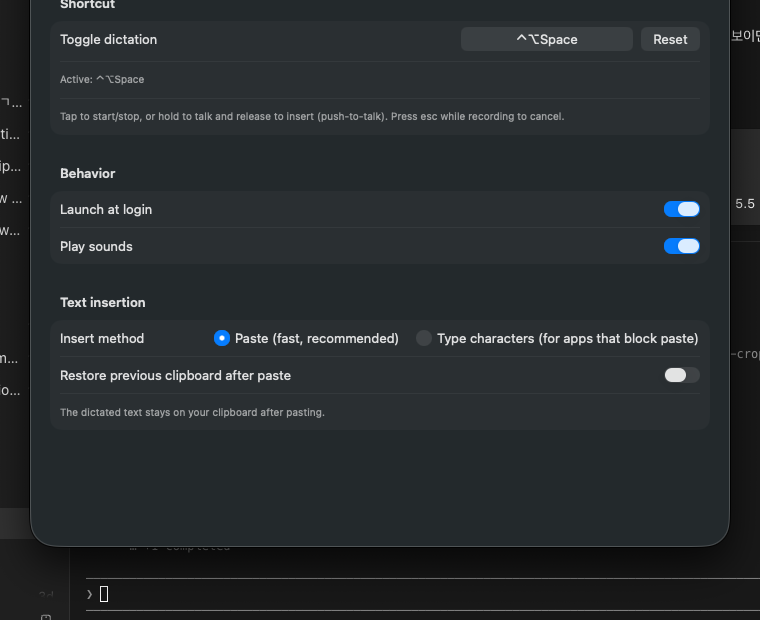
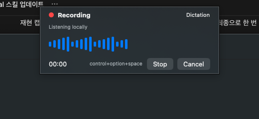

# VoiceSlave Onboarding Guide

VoiceSlave is a local-first macOS menu bar dictation app. The app is intentionally a background utility: after launch, look for the microphone icon in the macOS menu bar instead of the Dock.

## Install From Source

### Option A: Local unsigned app bundle

Use this when you want to try the app immediately on a development Mac.

```sh
./scripts/package-app.sh
ditto dist/VoiceSlave.app /Applications/VoiceSlave.app
open /Applications/VoiceSlave.app
```

Installing into `/Applications` lets you launch VoiceSlave from Spotlight (`⌘Space`, type "VoiceSlave") like any other app.

If macOS blocks the unsigned app, right-click `dist/VoiceSlave.app`, choose Open, and confirm. For a local development checkout you can also remove quarantine:

```sh
xattr -dr com.apple.quarantine dist/VoiceSlave.app
open dist/VoiceSlave.app
```

### Option B: Xcode build

Install Xcode, open it once, then select it:

```sh
sudo xcode-select -s /Applications/Xcode.app/Contents/Developer
./scripts/build-xcode.sh
```

For an archived `.app` export:

```sh
./scripts/archive-xcode.sh
open dist/xcode-export
```

Signing, notarization, and DMG packaging are intentionally separate release steps. Use a Developer ID certificate before sharing the app outside your own Mac.

## First Launch

1. Launch `VoiceSlave.app`. A welcome window opens automatically on first run.
2. Grant **Microphone** and **Speech Recognition** when prompted — these are required to dictate.
3. Grant **Accessibility** so results are pasted directly at your cursor. Without it, results are copied to the clipboard instead (the HUD tells you to press ⌘V).
4. Pick your dictation language — Automatic (system), 한국어, or English (US).
5. Try a dictation in the built-in test field, then click **Start using VoiceSlave**.

The global shortcut (`⌃⌥Space` by default) works immediately — it needs no permissions at all.



## Dictation Flow

1. Put your cursor where the text should go — any app.
2. Press `⌃⌥Space` (tap to toggle) **or** hold it, speak, and release (push-to-talk).
3. The recording pill appears at the bottom of the screen with a live waveform, elapsed time, and the live transcript as you speak.
4. Tap the shortcut again (or release, in push-to-talk) — the pill flips to "Transcribing…", then the text is pasted at your cursor and the pill shows `Inserted · 0.8s`.
5. Press `esc` at any time while recording to cancel.



Recognition runs on-device via Apple Speech when available (private, offline). "Automatic" follows the macOS system language — it does not detect the spoken language. If you speak Korean on an English-language Mac, set 한국어 explicitly (onboarding, Settings → Dictation, or the menu bar Language menu).

## Vocabulary & Replacements

Settings → Vocabulary fixes words the recognizer keeps getting wrong ("보이스 슬레이브" → "VoiceSlave"). Matching is case-insensitive; the replacement is inserted exactly as written. Entries are also fed to the recognizer as vocabulary hints.

## Cloud Modes

`Cleanup` and `Prompt` post-process the transcript with OpenAI and stay disabled until you save an API key (Settings → AI Modes; stored only in your macOS Keychain). When enabled, cloud post-processing sends only:

- raw transcript text
- explicit Personal Vocabulary hints

VoiceSlave must not send audio, clipboard contents, selected text, cursor surroundings, active app context, or app names. If the cloud call fails or times out, the locally cleaned transcript is inserted instead and history marks the entry "AI fallback".

## History And Deletion

Settings → History keeps every dictation (raw transcript, final output, mode, optional audio) in local SQLite under Application Support, excluded from backups. Search, copy, delete individual entries, delete everything, or pick a retention window — the default deletes entries older than 30 days automatically. Audio capture can be turned off entirely in Settings → Dictation.

## Troubleshooting

- No menu bar icon: make sure the app is running with `open dist/VoiceSlave.app`.
- Shortcut does nothing: another app may own it — pick a different one in Settings → General (click the shortcut field and press new keys).
- "Copied — press ⌘V" instead of auto-paste: grant Accessibility in Settings → Setup, then dictate again.
- Waveform is flat while recording: microphone permission is missing or the wrong input device is selected in macOS Sound settings.
- Paste-hostile app (secure fields, some terminals): switch Insert method to "Type characters" in Settings → General.
- Permission still denied after granting: quit and reopen VoiceSlave.
- Sharing with another Mac: use Xcode archive/export with Developer ID signing and notarization first.
